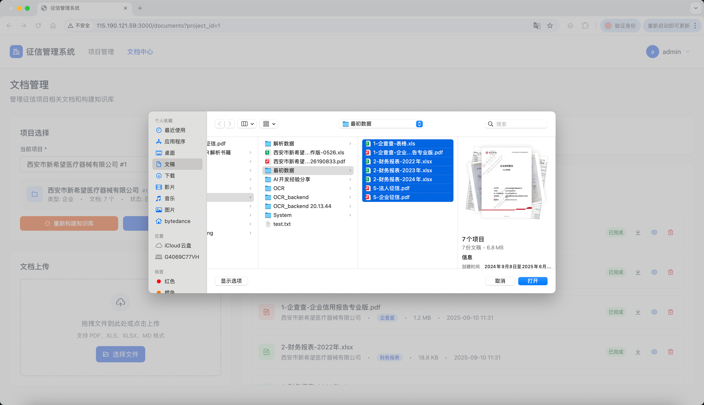
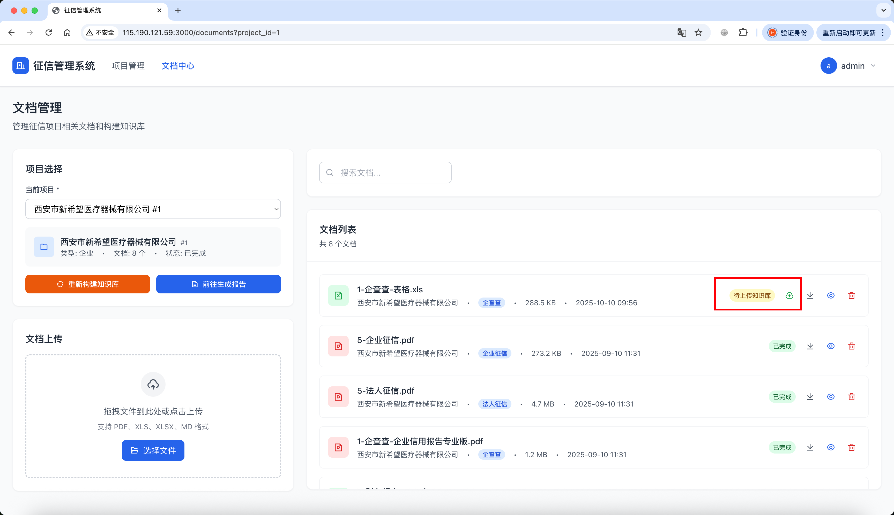

# 征信管理系统用户操作手册

## 系统简介

征信管理系统是一个智能化的征信分析平台，通过上传相关文档，系统能自动分析并生成专业的征信报告。

**访问地址**：http://115.190.121.59:3000/

---

## 1. 用户注册

### 1.1 注册入口

1. 访问系统首页
2. 点击"注册"按钮或链接
3. 进入用户注册页面

### 1.2 填写注册信息

必填信息：
- **用户名**：输入唯一的用户名
- **邮箱**：输入有效的邮箱地址
- **密码**：设置安全密码
- **确认密码**：再次输入密码确认

### 1.3 完成注册

1. 检查所有信息是否正确
2. 点击"注册"按钮
3. 系统自动跳转至项目管理界面

---

## 2. 用户登录

### 2.1 登录页面

首次访问系统时，会自动跳转到登录页面。

### 2.2 默认账户

系统预置了以下测试账户：

| 用户类型 | 用户名 | 密码 | 权限说明 |
|---------|--------|------|----------|
| 管理员  | admin  | admin123 | 完整系统权限 |
| 普通用户 | user1  | user123  | 基础操作权限 |

### 2.3 登录步骤

1. 在登录页面输入用户名和密码
2. 点击"登录"按钮
3. 系统验证成功后自动跳转到项目管理页面

---

## 3. 新建项目

### 3.1 项目列表页面

登录成功后，进入项目管理主页，显示所有项目列表。

页面功能说明：
- **项目卡片**：显示项目基本信息、进度、状态
- **搜索框**：支持按项目名称搜索
- **筛选器**：按项目类型、状态筛选
- **创建按钮**：新建项目

### 3.2 创建新项目

#### 3.2.1 打开创建页面

点击右上角"创建项目"按钮，打开项目创建弹窗。

#### 3.2.2 填写项目信息

必填字段：
- **项目名称**：输入有意义的项目名称
- **项目类型**：选择"个人"或"企业"

可选字段：
- **项目描述**：详细说明项目目标和要求
- **行业分类**：选择项目所属行业

#### 3.2.3 提交创建

1. 检查所有信息是否正确
2. 点击"创建项目"按钮
3. 创建成功后自动显示在项目管理页面

### 3.3 查看项目详情

#### 3.3.1 进入详情页面

在项目列表中，点击任意项目卡片的"查看详情"按钮。

#### 3.3.2 项目详情页面概览

- **项目文档**：管理项目相关文档
- **项目进度**：查看项目的当前进度和状态

---

## 4. 上传文件

### 4.1 进入文档管理

点击头栏中的"文档中心"，或项目详情页面的"上传文档"按钮，进入文档管理页面。

### 4.2 上传文档

1. 选择对应项目
2. 点击"上传文档"按钮
3. 选择要上传的文件
4. 系统自动开始上传和处理

### 4.3 支持的文件类型

- **PDF文档**：征信报告、财务报表等
- **Excel表格**：财务数据、统计表格
- **MD文件**：解析后各类报告的Markdown格式文件

## 5. 生成报告

### 5.1 进入分析页面

当所有文档解析完成后，可在文档管理页面点击"前往生成报告"按钮，返回项目详情页面

### 5.2 启动报告生成

此时点击"生成征信报告"按钮，可以开始生成征信报告。

---

## 6. 下载报告

### 6.1 报告预览

报告生成完成后，可以在线预览报告内容，也可以转换成PDF格式预览。

### 6.2 报告内容结构

标准征信报告包含：

- **执行摘要**：项目概况和主要结论
- **企业基本信息**：公司基础资料
- **财务分析**：详细的财务状况分析
- **经营分析**：业务运营情况评估
- **风险评估**：潜在风险识别和评级
- **建议措施**：改进建议和风险控制措施

### 6.3 下载操作

1. 点击"下载HTML"或"下载PDF"按钮，可分别下载html或pdf格式的报告
2. 保存到本地

